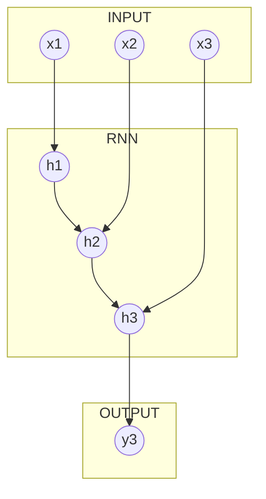

## Introduction to Recurrent Neural Network

In the previous chapters, we presented _simple_ [Feedforward Neural Networks](https://medium.com/towards-data-science/deep-learning-feedforward-neural-network-26a6705dbdc7) \(FNN\) that varied in size and purpose. These type of networks work well on structured \(fact based\) data where both event order information and location relative to other records is irrelevant. However, this, as you might imagine, is not always the case.

For example, consider images, where every pixel has a value and a specific location. This pixel's value by itself does not provide us with much information and it defiantly does not help us to understand the image. Thus in order to _see_ the image, the pixel's neighbours and their neighbour has to be considered as well. For these type of problems, the [Convolutional Neural Networks](http://cs231n.github.io/convolutional-networks/) \(CNN, _not a news agency!_\) are used, as they are created to learn from the information that is contained in the pixel and also around it. In this tutorial, we will not discuss this type of networks as they are not often used on the structured data, like, patient records, transaction records, etc.

However, the other type of network that is gaining popularity is the [Recurrent Neural Network](http://karpathy.github.io/2015/05/21/rnn-effectiveness/) \(RNN\).

Recurrent Neural Networks are called recurrent because they perform the same computations for all elements in a sequence of inputs. RNNs are becoming very popular due to their wide utility. Often used example is language, where a word order is as important as the word by itself. Similarly, if we consider a patient medical history, in order to make a _good_ prediction for some condition, it is not only important to know what the patient had before but also when it occurred.

The reason that makes recurrent networks exciting is that they allow us to operate over sequences of vectors or event timelines. This means that we can have sequences in the input or the output, or in the most general case both. Having sequences as inputs or outputs yields that in order to learn from this data efficiently, the network has to remember what it has seen. For that reason, RNN has an internal state, that is like a memory. As the RNN devours a sequence, the essential information about the sequence is maintained in this memory unit \(internal state\), and updated at each time-step. To learn more about RNNs, you can read these [series of articles](http://www.wildml.com/2015/09/recurrent-neural-networks-tutorial-part-1-introduction-to-rnns/) on RNN.

However, if a sequence is long, in practice, the internal state has a very difficult time to store all the information.  The problem lies, especially, with storing the beginning of the sequence. Due to this when we perform a back-propagation in order to update weights, the computed gradients become progressively smaller or larger as we come closer to the beginning of the sequence. This phenomenon is called the [Exploding and Vanishing Gradient](http://web.stanford.edu/class/cs224n/lecture_notes/cs224n-2017-notes5.pdf) problem for RNNs. To solve the problem of exploding gradients, a simple heuristic solution that clips gradients to a small number whenever they explode. That is, whenever they reach a certain threshold, they are set back to a small number. Whereas to solve the problem of vanishing gradients, the following two techniques are often used:

* instead of initializing weights randomly, we start off from an identity matrix initialization,
* instead of using the sigmoid activation function we can use the Rectified Linear Units \(ReLU\) function. The derivative for the ReLU is either 0 or 1. This way, gradients would flow through the neurons whose derivative is 1 without getting attenuated while propagating back through time-steps.

Another approach is to use more sophisticated units, such as [**LSTM** \(Long Short-Term Memory\)](https://en.wikipedia.org/wiki/Long_short-term_memory) or [**GRU** \(Gated Recurrent Unit\)](https://en.wikipedia.org/wiki/Gated_recurrent_unit). These units were explicitly designed to prevent the problem of exploding and vanishing gradients as well as improve long term memory of the RNNs.

> Note: Throughout this tutorial, we are going to use only GRU units as they are less expensive than LSTM, and there are no noticeable differences between results using either of the units.

### Recurrent Neural Network

This example we are using the data set that comes from [UC Irvine Machine Learning Repository](https://archive.ics.uci.edu/ml/index.php):

* Name: Appliances energy prediction Data Set
* Source: [https://archive.ics.uci.edu/ml/datasets/Appliances+energy+prediction](https://archive.ics.uci.edu/ml/datasets/Appliances+energy+prediction)

This data set will be used in all subsequent examples and, as mentioned in the previous chapter, we are going to consider only regression tasks from now on. In addition, the examples presented here are of the type **many to one**.



In the first example, we are going to use sequences as inputs and try to predict a point N-steps in the _future_. In what follows we are going to refer to this type of the prediction task as Sequence to Vector prediction, in future examples we will also Sequence to Sequence prediction.

#### Data Preparation

We start our data preparation by splitting input data into tree data set: Training, Validation and Test.  Then we separate features, targets and time variable. It has been shown that for some applications leaving time variable as an additional feature is advantageous, but in this particular example, we will neglect it. Further,  we rescale all the values in the training sets so that they lie between $$0$$ and $$1$$, and using training data set statistics we rescale Validation and Test data. Data preparation stage is completed after transforming flat-file time series to a sequential data.

In this example, all input sequences are of the same length, the parameter that defines the length is `INPUT_SEQUENCE_LENGTH`. In the code presented we also have parameter `OUTPUT_SEQUENCE_LENGTH` which for this example should remain 1 as we will try to predict only one point in the future. In order to tell how far in the future prediction should be we introduce `OUTPUT_SEQUENCE_STEPS_AHEAD` parameter. In the nutshell, in this stage, we transform the flat-file time series of the shape `[Time Step, Features]` to two sequential data sets. Input set is of the shape `[Batch, INPUT_SEQUENCE_LENGTH, Features]` and the output set has the shape `[Batch, 1, Features]`, and using input feature sequences we try to predict one target point.

Next step as before is a graph construction, but in this tutorial, we going to show how to create variables in the graph, make learning rate to decrease during computations, introduce a dropout layer and, of course, how to create recurrent neural network layers.

#### Graph Construction

As usual, we start with _inputs_ section, where, as suggested earlier, the shape of the input \(`in_seq`\) and output \(`out_seq`\) variables now is `[None, INPUT_SEQUENCE_LENGTH, INPUT_FEATURES]` and `[None, OUTPUT_SEQUENCE_LENGTH, OUTPUT_FEATURES]`, respectively.

```python
with tf.variable_scope("inputs"):
    # placeholder for input sequence
    in_seq = tf.placeholder(dtype=tf.float32, shape=[None, INPUT_SEQUENCE_LENGTH, INPUT_FEATURES], name="predictors")
    # placeholder for output sequence
    out_seq = tf.placeholder(dtype=tf.float32, shape=[None, OUTPUT_SEQUENCE_LENGTH, OUTPUT_FEATURES], name="target")
    # placeholder for boolean that controls dropout
    training = tf.placeholder_with_default(input=False, shape=None, name="dropout_switch")
    with tf.variable_scope("learning_rate"):
        # define iteration counter
        global_step = tf.Variable(initial_value=0, trainable=False, name="global_step")
        # create exponentially decaying learning rate operator
        learning_rate = tf.train.exponential_decay(learning_rate=INITIAL_LEARNING_RATE, global_step=global_step,
                                                   decay_steps=LEARNING_RATE_DECAY_STEPS,
                                                   decay_rate=LEARNING_RATE_DECAY_RATE, staircase=True,
                                                   name="learning_rate")
```

In the code snippet above you can see a few new variables, such as, `training` and everything that is under _learning\_rate_ variable scope.

So, first things first, `training` is a `tf.placeholder_with_default()` tensor, which is similar to `tf.placeholder()` but has an additional `input` parameter where we can specify a default value in the case if during the graph's execution no value is provided. In this particular case, a default value is set to a boolean `False` value, and it acts as a switch that tells the graph if we are using it to train or test.

Next, as the variable scope name suggests, all variables here are related to the learning rate, which is now decreasing during computations. The first variable here has [`tf.Variable()`](https://www.tensorflow.org/programmers_guide/variables) class. The difference between a `tf.constant()` and a `tf.Variable()` is that a constant is constant and that is it but variable can be assigned to and its value can be changed. Constant's value is stored in the graph definition and its value is replicated wherever the graph is loaded, this means that constants are memory expensive. However, `tf.Variable()` it is an in-memory buffer that contains a tensor and it can be stored outside the graph. Here, `global_step` variable acts as an iteration counter that is incremented at each training step. It is used in the next operation, [`tf.train.exponential_decay()`](https://www.tensorflow.org/api_docs/python/tf/train/exponential_decay), which applies exponential decay to the learning rate.

When training a model, it is often recommended to lower the learning rate as the training progresses. This function applies an exponential decay function to a provided initial learning rate \(`learning_rate`\). It requires the previously defined `global_step` value to compute the decayed learning rate. The remaining parameters, `decay_steps`, `decay_rate` and `staircase`, are the number of steps after which to decrease the learning rate, decay rate and staircase function which, if `True`, decays the learning rate at discrete intervals, respectively.

Further, having specified all the necessary variables we can proceed with constructing the recurrent neural network part of the graph.

```python
with tf.variable_scope("recurrent_layer"):
    # Create list of GRU unit recurrent network cell
    gru_cells = [tf.nn.rnn_cell.GRUCell(num_units=l["units"], activation=l["act_fn"]) for l in GRU_LAYERS]
    # Connects multiple RNN cells
    rnn_cells = tf.nn.rnn_cell.MultiRNNCell(cells=gru_cells)
    # Creates a recurrent neural network by performs fully dynamic unrolling of inputs
    rnn_output, rnn_state = tf.nn.dynamic_rnn(cell=rnn_cells, inputs=in_seq, dtype=tf.float32)
```

As we said, in this and what follows we are going to use only the GRU units for RNN. For another type of cells, see [here](https://www.tensorflow.org/api_docs/python/tf/nn/rnn_cell). In TensorFlow GRU cell is [`tf.nn.rnn_cell.GRUCell()`](https://www.tensorflow.org/api_docs/python/tf/contrib/rnn/GRUCell), this function requires one parameter, `num_units`,  which defines a number of hidden units per cell. Next, we combine all the cells into a list which is passed to `tf.nn.rnn_cell.MultiRNNCell()` function that takes all single cells. Next function, [`tf.nn.dynamic_rnn()`](https://www.tensorflow.org/api_docs/python/tf/nn/dynamic_rnn) is responsible for creation of the actual RNN.

> Note: In other tutorials you may have seen another function [`tf.nn.static_rnn()`](https://www.tensorflow.org/api_docs/python/tf/nn/static_rnn) that creates a recurrent neural network. This function is still available in the API but there have been suggestions that it will be deprecated one day due to its limitation that we will touch on in the following examples.

In this particular situation, it only requires three parameters, which are our stacked cells, the RNN input tensor, and the data type for the initial state and expected output. The last parameter is required if the initial state is not provided.

These lines are everything that is needed to construct a multi-layer RNN. So, next step is to use RNN to make a prediction.

```python
with tf.variable_scope("predictions"):
    # 1) Select the last relevant RNN output.
    # last_output = rnn_output[:, -1, :]
    # However, the last output is simply equal to the last state.
    # output = rnn_state[-1]

    # 2) Select all RNN outputs
    output = tf.concat(values=rnn_state, axis=1)

    # Here prediction is the one feature vector at the time point (not a sequence of the feature vectors)
    prediction = tf.layers.dense(inputs=output, units=OUTPUT_FEATURES, name="prediction")
    # Reduce dimension of the input tensor
    truth = tf.squeeze(input=out_seq, axis=1)
    # Define loss function as mean square error (MSE)
    loss = tf.losses.mean_squared_error(labels=truth, predictions=prediction)
    train_step = tf.train.GradientDescentOptimizer(learning_rate=learning_rate).minimize(loss=loss, global_step=global_step)
```

The output of the \[`tf.nn.dynamic_rnn()`\] function is a tuple that contains cell outputs and the states for all timesteps. In order to make a prediction we are using the output of the last timestep or in this situation, it is also the last RNN state.  The last output tensor then is passed to the dropout layer, which is used to prevent an overfitting. Function [`tf.layers.dropout()`](https://www.tensorflow.org/api_docs/python/tf/layers/dropout) requires only one parameter `inputs`. Dropout has to be applied only during the training phase and when we compute predictions or other calculation it has to be switched off. This can be achieved in two ways, first, passing different `rate` values for each phase or as we have done, by passing a `training` boolean.

> Note: In this particular example, the dropout does not have the noticeable impact as our network is small. In the next example, we will show how to apply dropout to RNN cells.

Remaining steps in the graph are the same as earlier examples, with one exception. As the output of the dense layer is 2-dimensional tensor but our ground truth input tensor is 3-dimensional tensor with length in one direction being one, we cannot compare both tensors. To resolve this issue we have to decrease the dimensionality of the largest tensor, by, in this case, removing dimension of size 1 from the shape of the tensor.

Graph execution follows the same steps as in previous examples. The only modification that has been done is for `feed_dict` parameter, as it now allows the third value, `training`, that tells the graph if we perform training or not and that subsequently turns on and off the dropout layer.

This chapter has references to two python scripts. The first of which, [04\_01\_rnn.py](/scripts/04_01_rnn.py). was described in detail above, but as the second scripts have only one change, we will explain only it.

In the script [04\_02\_rnn.py](/scripts/04_02_rnn.py), we show how to add a dropout layer around RNN cells. To do this we use [`tf.nn.rnn_cell.DropoutWrapper()`](https://www.tensorflow.org/api_docs/python/tf/contrib/rnn/DropoutWrapper). Specifying dropout probabilities for `input_keep_prob` and `output_keep_prob` parameters we can add dropout to inputs and outputs for the given cell. Unfortunately, at this moment, this function does not take the parameter that informs the wrapper if we are training or testing the model, as it was in the case of `tf.layers.dropout()`. To resolve this issue, as mentioned earlier, we can use more than one approach. However, as we have already introduced the boolean switch `training`, we will show how to use it.

```python
with tf.variable_scope("recurrent_layer"):
    # Create a list of GRU unit recurrent network cells with dropouts wrapped around each.
    def with_dropout(layers, rnn_input):
        with tf.variable_scope("with_dropout"):
            gru_cells = [tf.nn.rnn_cell.DropoutWrapper(cell=tf.nn.rnn_cell.GRUCell(num_units=l["units"],
                                                                                   activation=l["act_fn"]),
                                                       output_keep_prob=l["keep_prob"]) for l in layers]
            # Connects multiple RNN cells
            rnn_cells = tf.nn.rnn_cell.MultiRNNCell(cells=gru_cells)
            # Creates a recurrent neural network by performs fully dynamic unrolling of inputs
            return tf.nn.dynamic_rnn(cell=rnn_cells, inputs=rnn_input, dtype=tf.float32)


    def without_dropout(layers, rnn_input):
        with tf.variable_scope("without_dropout"):
            gru_cells = [tf.nn.rnn_cell.GRUCell(num_units=l["units"], activation=l["act_fn"]) for l in layers]
            # Connects multiple RNN cells
            rnn_cells = tf.nn.rnn_cell.MultiRNNCell(cells=gru_cells)
            # Creates a recurrent neural network by performs fully dynamic unrolling of inputs
            return tf.nn.dynamic_rnn(cell=rnn_cells, inputs=rnn_input, dtype=tf.float32)


    rnn_output, rnn_state = tf.cond(training,
                                    true_fn=lambda: with_dropout(layers=GRU_LAYERS, rnn_input=in_seq),
                                    false_fn=lambda: without_dropout(layers=GRU_LAYERS, rnn_input=in_seq))
```

TensorFlow does not allow us to use standard python `if` statement in the graph, but is has its own implementation for conditional execution, [`tf.cond()`](https://www.tensorflow.org/api_docs/python/tf/cond). This function requires three parameters, `pred` which is `tf.bool` type and determines whether to return the result of functions `true_fn` or `false_fn`. Function `true_fn` is executed if `pred` is true and `false_fn` otherwise.

As `tf.cond()` function returns only a list of tensors and  `tf.nn.rnn_cell.MultiRNNCell()`, `tf.nn.rnn_cell.DropoutWrapper()` and `tf.nn.rnn_cell.GRUCell()` return objects that are not tensors, all these _ops_ have to be wrapped into  `true_fn` or `false_fn` functions. The output of each of the functions equal to the output of `tf.nn.dynamic_rnn()` function.

#### Hyperparameters

In addition to already mentioned hyperparameters in the previous chapters, this model has three more that are associated with the learning rate: `INITIAL_LEARNING_RATE`, `LEARNING_RATE_DECAY_STEPS`, `LEARNING_RATE_DECAY_RATE`.

### Overfitting

Earlier we mentioned overfitting and introduced dropout layer without explanation. Therefore in this section,  we will spend a little bit more time explaining overfitting and how to deal with it using a dropout.

Increasing the size of the neural network by increasing the number of neurons per layers or/and increasing the number of layers, the network tends to memorize data rather than "find" relationships between data. This leads to overfitting. In order to avoid this effect two techniques are often used: [Regularization](https://en.wikipedia.org/wiki/Regularization_%28mathematics%29) and [Dropout](https://www.cs.toronto.edu/~hinton/absps/JMLRdropout.pdf). This technique can be used together as well as on its own.

> Note: It is advisable to use neural networks with many layers that have a small number of neurons per layer.

#### Dropout

Dropout, in the nutshell, is a technique where during the training iterations a number of the neurons in certain layers are randomly deactivated. This forces, remaining neurons in the layer, to compensate the loss of information by learning _concepts_ that their colleagues knew before they were deactivated. Normally, the dropout is used after fully-connected layers but is also possible to use the dropout after another type of layers.

It is important to note that dropout, during the evaluation and prediction phases, has to be turned off.

### TensorBoard

As we mentioned before, in TensorFlow, you collectively call constants, variables, operators as _ops_. TensorFlow is not just a software library, but a suite of software that includes TensorFlow, TensorBoard, and TensorServing. To make the most out of TensorFlow, we should know how to use all of the above in conjunction with one another. In this section, we will introduce TensorBoard.

TensorBoard is a graph visualization software \(Web App\) included with any standard TensorFlow installation. When a user performs certain operations in a TensorBoard-activated TensorFlow program, these operations are exported to an event file. TensorBoard is able to convert these event files to graphs that can give insight into a model’s behaviour.

In the code that is referenced in this chapter you may see the following lines in the graph construction stage for:

* `inputs` variables:

```python
# Add the following variables to log/summary file that is used by TensorBoard
tf.summary.scalar(name="learning_rate", tensor=learning_rate)
tf.summary.scalar(name="global_step", tensor=global_step)
```

* `predictions` variables:

```python
# Add the following variables to log/summary file that is used by TensorBoard
tf.summary.scalar(name="MSE", tensor=loss)
tf.summary.scalar(name="RMSE", tensor=tf.sqrt(x=loss))
```

In both cases we use [`tf.summary.scalar()`](https://www.tensorflow.org/api_docs/python/tf/summary/scalar). It is a method that exports information about a single scalar value. It requires two parameters `name`, which is a string that helps to identify the tensor value in TensorBoard and `tensor`, which is a tensor value itself.

Further, you will find the following line before the graph execution,

```python
# Merge all the summaries
merged = tf.summary.merge_all()
```

This _op_ merges all summaries collected in the default graph. Next, during the graph execution stage, you can see,

```python
# Write merged summaries out to the graph_path (initialization)
summary_writer = tf.summary.FileWriter(logdir=graph_path, graph=sess.graph)
```

Here FileWriter class provides a mechanism to create an event file in a given directory and add summaries and events to it. The class updates the file contents asynchronously. This allows a training program to call methods to add data to the file directly from the training loop, without slowing down training. As you might guess, it requires two parameters, `logdir` - location of the event file directory, and `graph` which is Graph object that is used in the current session.

After we have initialized the FileWriters, we have to add summaries to the FileWriters as we train and test the model. This is achieved by the following lines,

```python
# Evaluate all variables that are contained in summary/log object and write them out into the log file
summary = merged.eval(feed_dict={in_seq: x_input_val, out_seq: x_output_val, training: False})
summary_writer.add_summary(summary=summary, global_step=e)
```

We first evaluate all tensors in the summaries and then add them to the FileWriter which writes out all the values to the event file.

To visualize these values we have to launch TensorBoard using command line and specifying the location of the event file,

```bash
tensorboard --logdir="path/to/event-directory"
```

In this particular example `"path/to/event-directory"` is something like this `/data/04/basic/graph`.

### Next

In the [next chapter](/chapters/chapter7.md) we will show how to modify the code presented here in order to make sequential predictions rather than just points at a certain time. We will also show how to deal input sequences that do not have the same length.

### Code

* [04\_01\_rnn.py](/scripts/04_01_rnn.py)
* [04\_02\_rnn.py](/scripts/04_02_rnn.py)

### References

* [Andrej Karpathy blog](http://karpathy.github.io/)
* [colah's blog](http://colah.github.io/)
* [CS224n: Natural Language Processing with Deep Learning](http://web.stanford.edu/class/cs224n/)
* [CS231n: Convolutional Neural Networks for Visual Recognition.](http://cs231n.github.io/)
* [Deep Learning: Feedforward Neural Network](https://medium.com/towards-data-science/deep-learning-feedforward-neural-network-26a6705dbdc7)
* [Recurrent Neural Networks Tutorial, Part 1 – Introduction to RNNs](http://www.wildml.com/2015/09/recurrent-neural-networks-tutorial-part-1-introduction-to-rnns/)
* Wikipedia articles on [Long Short-Term Memory](https://en.wikipedia.org/wiki/Long_short-term_memory), [Gated Recurrent Unit](https://en.wikipedia.org/wiki/Gated_recurrent_unit) and [Regularization](https://en.wikipedia.org/wiki/Regularization_%28mathematics%29)


