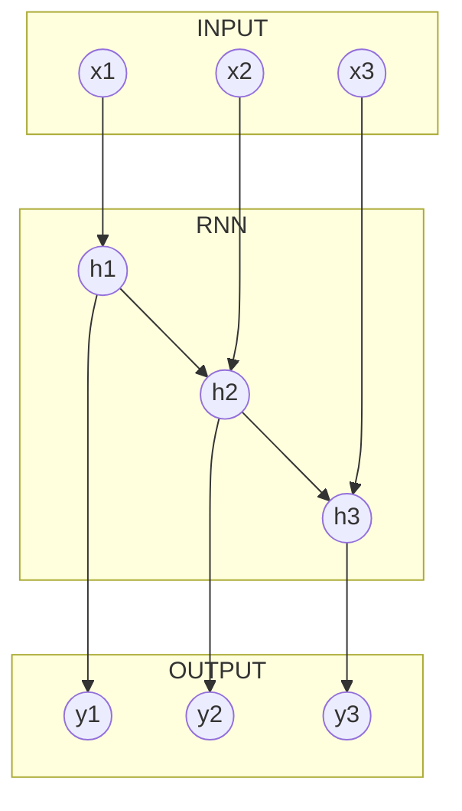

## Recurrent Neural Network and Sequences

In this chapter, we are going to cover the case when we have input sequences with variable lengths and the case when we want to predict a time sequence rather just a point in time. Later is achieved by **many to many** type recurrent neural network.



We will start with time sequence prediction as it requires only a slight adjustment to the code that we considered in the previous chapter.

### Sequence prediction

The data set used in this example is the same as before. The only difference in the data preparation step is that instead of having one target vector for each input sequence, we have a sequence of target vectors with the same length as the input sequence. See [04\_03\_seq\_rnn.py](/scripts/04_03_seq_rnn.py) script.

> Note: Restriction of having equal input and output sequence lengths is set for convenience rather than necessity, thus feel free to play around.

The difference in the code appears only in `predictions` variable scope.

```python
with tf.variable_scope("predictions"):
    with tf.variable_scope("output_projection"):
        # Stacks all RNN outputs
        stacked_rnn_outputs = tf.reshape(tensor=rnn_output, shape=[-1, RNN_LAYERS[-1]["units"]])
        # Passes stacked outputs through dense layer
        stacked_outputs = tf.layers.dense(inputs=stacked_rnn_outputs, units=OUTPUT_FEATURES)
        # Reshapes stacked_outputs back to sequences
        prediction = tf.reshape(tensor=stacked_outputs, shape=[-1, INPUT_SEQUENCE_LENGTH, OUTPUT_FEATURES],
                                name="prediction")

    # Define loss function as mean square error (MSE)
    loss = tf.losses.mean_squared_error(labels=out_seq, predictions=prediction)
    train_step = tf.train.AdamOptimizer(learning_rate=LEARNING_RATE).minimize(loss=loss)

    # Add the following variables to log/summary file that is used by TensorBoard
    tf.summary.scalar(name="MSE", tensor=loss)
    tf.summary.scalar(name="RMSE", tensor=tf.sqrt(x=loss))
```

As you can see we have introduced new variable scope `output_projection`, where we collect all outputs of the last RNN layer and reshape tensor of size `[BATCH, INPUT_SEQUENCE_LENGTH, (Last RNN layer neurons count)]` to tensor with shape `[BATCH * INPUT_SEQUENCE_LENGTH, (Last RNN layer neurons count)]`. Further, we pass this stacked output through the fully connected layer with `OUTPUT_FEATURES` neurons and without any activations. This performs RNN output projection from  `(Last RNN layer neurons count)` features to the desired number of output features. Next, we unstuck the reduced output by converting 2-dimensional tensor back to 3-dimensional tensor with `[BATCH, INPUT_SEQUENCE_LENGTH, OUTPUT_FEATURES]` shape. Rest of the code remains the same as before.

### Variable length sequences

So far we have used only fixed-size input sequences. What if the input
sequences have variable lengths, like patients medical or companies transaction histories?

```mermaid
gantt
    dateFormat  YYYY-MM-DD
    section Patient 1
    Record          :today, 20d
    section Patient 2
    Record          :today, 7d
    section Patient 3
    Record          :today, 12d  
```

This example will consider exactly this situation, see [05\_variable\_seq.py](/scripts/05_variable_seq.py).

As usual, we start with obtaining a data set, that in this case is going to be generated from scratch. For this we are using `get_values()` `create_features()` and `create_targets()` functions.
Here the output feature array has shape `[Record_count, Max_Sequence_Lenght, Feature_count]` and for the target array it is `[Record_count, 1, Feature_count]`. As you can see the feature array on the input to the graph contains sequences of the same length, it is equal to `Max_Sequence_Lenght`. This is due to the requirement that tensors that are passed to a graph have to have consistent dimensions. However, if we take a closer look at `create_features()` function,

```python
def create_features(t, slice_len, max_slice_len):
    """
    Function creates an features array
    :param t: Array of values sequential values
    :type t: numpy.array()
    :param slice_len: length of the sequence
    :type slice_len: int
    :param max_slice_len: max length of sequences
    :type max_slice_len: int
    :return: Feature array  of shape [1, max_slice_len, feature_number]
    :rtype: numpy.array()
    """
    # Initialize empty list
    f = list()
    for val in get_values(t):
        # Generate list of vectors where each vector is padded with [max_slice_len - slice_len] zeros from the back,
        # that is [1,2,3,4,0,0,0], in order make all sequences of the same length [max_slice_len].
        f.append(np.concatenate((val[:slice_len], np.zeros(shape=(max_slice_len - slice_len, 1))), axis=0))
    # Concatenate all vectors in the resulting list and then add an additional dimension.
    return np.expand_dims(a=np.concatenate(f, axis=1), axis=0)
```
we can see that indeed each sequence in the data set has variable length but they are padded by zeros, in order to ensure that the final length of the each sequence is `Max_Sequence_Lenght`. In addition, variable `seq_len` keeps a record of the original length value for each sequence in the data set.

We conclude the first step by split data set into Training, Validation and Test data sets.

The second stage is, as before, graph construction, where we follow the same steps as in all previous examples. Here, however, in addition to already familiar placeholders we introduce `sequence_length`,
```python
sequence_length = tf.placeholder(dtype=tf.float32, shape=[None], name="sequence_length")
```
This placeholder will accept each sequence length value which is contained in `seq_len`.
This tensor then is passed to `tf.nn.dynamic_rnn()` _ops_ as an additional `sequence_length` parameter,
```python
rnn_output, rnn_state = tf.nn.dynamic_rnn(cell=rnn_cells, inputs=input_seq, dtype=tf.float32,
                                            sequence_length=sequence_length)
```
Now RNN outputs zero vectors for every time step past the input sequence length. Moreover, the states tensor contains the final state of each cell (excluding the zero vectors). This allows us to use the final state as before and for that reason the rest of the code in the script and stages are similar to the code described in the previous chapters. 

### Next

Sadly, these are the last examples that this tutorial will present. In the [next chapter](chapters/chapter8.md), we will just give some random thoughts on TensorFlow.

### Code

* [04\_03\_seq\_rnn.py](/scripts/04_03_seq_rnn.py)
* [05\_variable\_seq.py](/scripts/05_variable_seq.py)

### References
