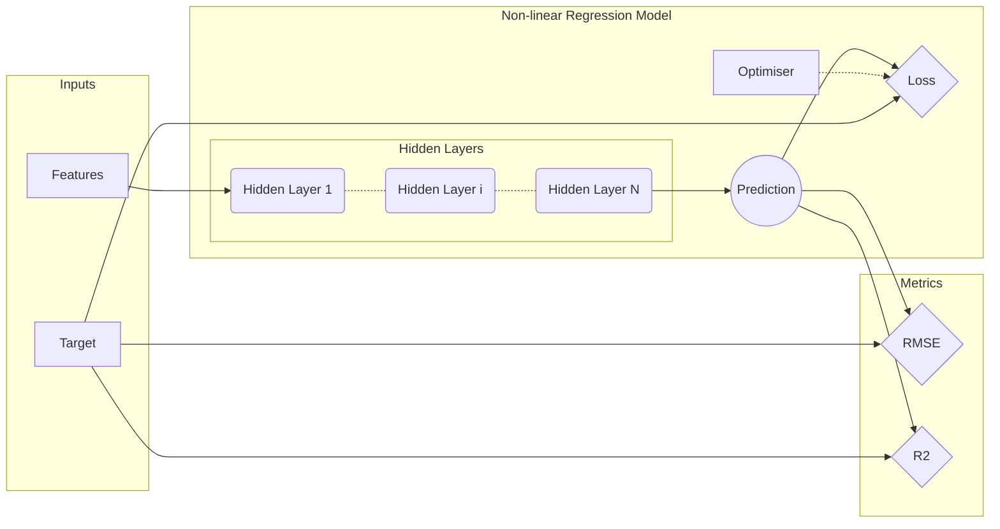

## Nonlinear Regression
In the previous chapters, we dealt with simple models that worked well for linear relationships. However, not everything can be described by linear functions, and therefore, use of the more sophisticated model is required. In this chapter, we will see how to extend the Linear Regression model to a Nonlinear Regression Model or, in the other words, to a fully-connected neural network.

For brevity, we will limit our examples to the model that performs the regression task, as just by changing the cost function, it is possible to use the same graph for the classification task.

### Graph Construction
In this example, we use the same synthetic data that we were using in the Linear Regression example with one slight modification for the target values. Here we perform an element-wise multiplication of `target_1` and `target_2` arrays instead of concatenating them. As the result, the shape of the final `target` array is `[1000, 1]` instead of `[1000, 2]`.

#### Nonlinear Regression Model
As already mentioned, the graph presented here is, essentially, just an extension of the graph described in the previous chapter. Therefore, definitions of `inputs` and `metrics` variable scopes and of `loss` and `train_step` tensors remain exactly the same as for the Linear Regression graph.
```python
# Predictions are performed by Y_FEATURES neurons in the output layer
prediction = tf.layers.dense(inputs=h, units=Y_FEATURES, name="prediction")
# Define loss function as root square mean (RMSE) and record its value
loss = tf.losses.mean_squared_error(labels=y_true, predictions=prediction)
train_step = tf.train.GradientDescentOptimizer(learning_rate=LEARNING_RATE).minimize(loss=loss)
```
The difference is in the definition of `prediction` tensor, where input parameter now is a tensor `h` instead of `x`.
```python
with tf.variable_scope('hidden layers'):
    # Constructs hidden fully connected layer network
    h = hidden_layers(in_tensor=x, layers=LAYERS)
```
In this situation, tensor `h` (hidden) is equal to output of `hidden_layers()` function.
```python
def hidden_layers(in_tensor, layers):
    """
    Function stacks fully connected layers

    :param in_tensor: Input Tensor
    :type in_tensor: Tensor
    :param layers: List of dictionaries that contain a number of neurons for the particular layer ad the activation
    function in the layer
    :type layers: list(dict("units", "act_fn"))
    :return: Tensor of the last densely connected layer
    :rtype: Tensor
    """
    h_input = in_tensor
    for i, l in enumerate(layers):
        h_input = tf.layers.dense(inputs=h_input, units=l["units"], activation=l["act_fn"],
                                  name='hidden_{i}'.format(i=i))
    return h_input
```
This function combines multiple fully-connected layers of a variable size. The first layer in the stack takes as a input tensor the `in_tensor` parameter. All subsequent layers take in previous layer output until the last layer is reached. The output of the last layer is also a return object of the function, that is `h` tensor. Function `hidden_layers()` has two parameters where the first, `in_tensor` is the node (tensor) to which the hidden layers will be connected to and `layers` parameter is list of dictionaries for each layer describing number of units (neurons) and the type of the activation function per layer.

When visualised the computational graph for this model would look as follows,

Here the first section is *Inputs* then it is followed by the *Nonlinear Regression Model* where we find *Hidden Layers* subsection with N (number of hidden layers) fully-connected layers are stacked together. The output of this subsection is passed to the *Prediction* node which later is used to compute `loss` and other quantities in *Metrics* section.

In order to perform computations on the graph, we use the same functions as in the previous example. However, to show how to save and restore trained models we split the training cycle into two stages. In addition, in this example, we used `with tf.Session() as sess:` to create a `Session` instead of `tf.InteractiveSession()`.

We start by training model for the first 1/3 of the total training epochs after which we save the model and detached the `Session` from the graph.
```python
save_path = saver.save(sess=sess, save_path=checkpoint_path)
print("Model saved in file: {path}".format(path=save_path))
```
Next, we create new `Seesion` and connect it to the graph. After that we load the previously saved model and continue with training the model.
```python
# Restore model from previously saved model
saver.restore(sess=sess, save_path=checkpoint_path)
print("Model restored from file: {path}".format(path=save_path))
```

### Model Saving and Restoring  Models
The easiest way to [save and restore a model](https://www.tensorflow.org/versions/master/programmers_guide/saved_model) is to use a [`tf.train.Saver()`](https://www.tensorflow.org/api_docs/python/tf/train/Saver) operator in TensorFlow. The constructor adds save and restore *ops* to the graph for all, or a specified list, of the variables in the graph. The *Saver* operator provides methods to run these *ops*, specifying paths for the checkpoint files to write to or read from. Variables are saved in binary files that, roughly, contain a map from variable names to tensor values. When you create a *Saver* operator, you can optionally choose names for the variables in the checkpoint files. By default, it uses the value of the `Variable.name` property for each variable. To understand what variables are in a checkpoint, you can use the `inspect_checkpoint` library, and in particular, the `tf.print_tensors_in_checkpoint_file()` function. If you do not pass any argument to `tf.train.Saver()` the saver handles all variables in the graph. Each one of them is saved under the name that was passed when the variable was created. It is sometimes useful to explicitly specify names for variables in the checkpoint files. For example, you may have trained a model with a variable named *weights* whose value you want to restore in a new variable named *params*. It is also sometimes useful to only save or restore a subset of the variables used by a model.
```python
# Create some variables.
v1 = tf.Variable(..., name="v1")
v2 = tf.Variable(..., name="v2")
# Add ops to save and restore only 'v2' using the name "my_v2"
saver = tf.train.Saver({"my_v2": v2})
# Use the saver object normally after that.
```
For example, you may have trained a neural net with 5 layers, and you now want to train a new model with 6 layers, restoring the parameters from the 5 layers of the previously trained model into the first 5 layers of the new model.You can easily specify the names and variables to save by passing to the `tf.train.Saver()` constructor a Python dictionary: keys are the names to use, values are the variables to manage.

You can create as many *Saver* operators as you want if you need to save and restore different subsets of the model variables. The same variable can be listed in multiple *Saver* operator, its value is only changed when the saver `restore()` method is run.

> Note: When you restore all variables from a file you do not have to initialize them beforehand, but if you only restore a subset of the model variables at the start of a `Session`, you have to run an initialize *op* for the other variables.

### Optimizers
As before, in this example, we use the gradient descent algorithm to optimize the weights and biases. However, as mentioned before, TensorFlow has a large collection of implemented optimization algorithms, see [here](https://www.tensorflow.org/api_guides/python/train). A good summary of different types of optimization algorithms is available [here](http://ruder.io/optimizing-gradient-descent/) and [here](https://leonardoaraujosantos.gitbooks.io/artificial-inteligence/content/model_optimization.html).
> Note: Right choice of optimization algorithms can significantly reduce training time as well as a quality of the model, therefore the algorithm is an additional hyperparameter that has to be considered.

### Activation functions
In this example, we introduced a notion of the [activation function](https://en.wikipedia.org/wiki/Activation_function) which has an essential part in the neural networks. It ensures that values in the network have nonlinear characteristics. Similarly to the optimization algorithms, TensorFlow has a collection of activation *ops*, the list of which is available [here](https://www.tensorflow.org/api_guides/python/nn). A good summary of different types of the activations functions is available [here](http://cs231n.github.io/neural-networks-1/)

In this particular example, for all hidden layers, we used [Rectified Linear Unit](https://en.wikipedia.org/wiki/Rectifier_(neural_networks)).

### Overfitting
Increasing the size of the neural network by increasing the number of neurons per layers or/and increasing the number of layers, the network becomes more prone to overfitting. In order to avoid this effect two techniques are often used: [Regularization](https://en.wikipedia.org/wiki/Regularization_(mathematics)) and [Dropout](https://www.cs.toronto.edu/~hinton/absps/JMLRdropout.pdf). This technique can be used together as well as on its own.

> Note: It is advisable to use deep neural networks with small layers, that is, a lot of layers with a small number of neuron per layer.

#### Dropout
Dropout, in the nutshell, is a technique where during the training iterations a number of the neurons in certain layers are randomly deactivated. This forces, remaining neurons in the layer, to compensate the loss of information by learning *concepts* that their colleagues knew before they were deactivated. Normally, the dropout is used after fully-connected layers but is also possible to use the dropout after another type of layers.

It is important to note that the dropout during the evaluation and prediction phases has to be turned off.

We will see TensorFlow implementations of the dropout in the next chapter. 

### Code
+ [03_nonlinear_regression.py](scripts/03_nonlinear_regression.py)

### References
+ [Artificial Intelligence GitBook](https://www.gitbook.com/book/leonardoaraujosantos/artificial-inteligence/details)
+ [CS231n: Convolutional Neural Networks for Visual Recognition](http://cs231n.github.io/)
+ [Sebastian Ruder blog](http://ruder.io/#open)
+ [Srivastava, N., Hinton, G., Krizhevsky, A., Sutskever, I., & Salakhutdinov, R. (2014). Dropout: A Simple Way to Prevent Neural Networks from Overfitting. Journal of Machine Learning Research, 15, 1929–1958.](https://www.cs.toronto.edu/~hinton/absps/JMLRdropout.pdf)
+ Wikipedia articles on [Activation Function](https://en.wikipedia.org/wiki/Activation_function), [Rectified Linear Unit](https://en.wikipedia.org/wiki/Rectifier_(neural_networks)) and [Regularization](https://en.wikipedia.org/wiki/Regularization_(mathematics))
