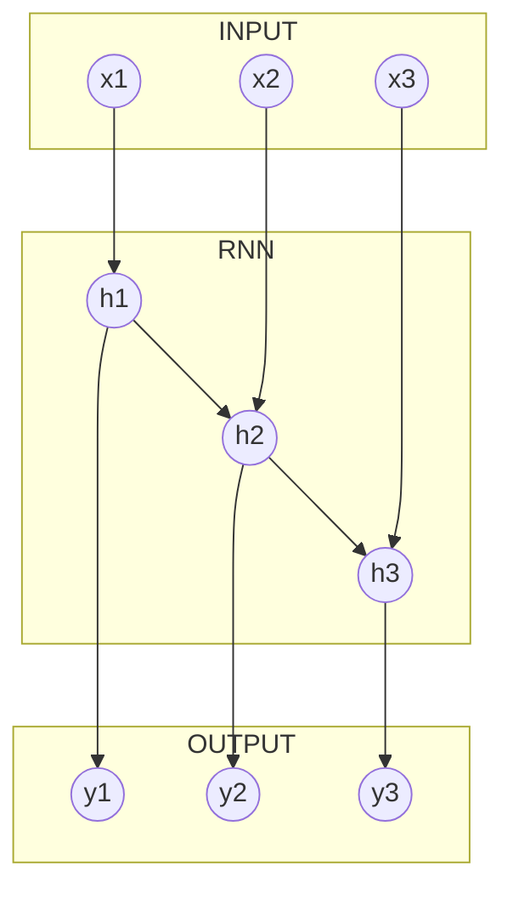

## Recurrent Neural Network and Sequences

In this chapter, we are going to cover the case when we have input sequences with variable lengths and the case when we want to predict a time sequence rather just a point in time. Later is achieved by **many to many** type recurrent neural network.



We shell start with time sequence prediction as it requires only a slight adjustment to the code that we considered in the previous chapter.

### Sequence prediction

The data set used in this example is the same as before. The only difference in the data preparation step is that instead of having one target vector for each input sequence, we have a sequence of target vectors with the same length as the input sequence.

> Note: Restriction of having equal input and output sequence lengths is set for convenience rather than necessity, thus feel free to play around.

The difference in the code appears only in `predictions` variable scope.

```python
with tf.variable_scope("predictions"):
    with tf.variable_scope("output_projection"):
        # Stacks all RNN outputs
        stacked_rnn_outputs = tf.reshape(tensor=rnn_output, shape=[-1, RNN_LAYERS[-1]["units"]])
        # Passes stacked outputs through dense layer
        stacked_outputs = tf.layers.dense(inputs=stacked_rnn_outputs, units=OUTPUT_FEATURES)
        # Reshapes stacked_outputs back to sequences
        prediction = tf.reshape(tensor=stacked_outputs, shape=[-1, INPUT_SEQUENCE_LENGTH, OUTPUT_FEATURES],
                                name="prediction")

    # Define loss function as mean square error (MSE)
    loss = tf.losses.mean_squared_error(labels=out_seq, predictions=prediction)
    train_step = tf.train.AdamOptimizer(learning_rate=LEARNING_RATE).minimize(loss=loss)

    # Add the following variables to log/summary file that is used by TensorBoard
    tf.summary.scalar(name="MSE", tensor=loss)
    tf.summary.scalar(name="RMSE", tensor=tf.sqrt(x=loss))
```

As you can see we have introduced new variable scope `output_projection`, where we collect all outputs of the last RNN layer and reshape tensor of size `[BATCH, INPUT_SEQUENCE_LENGTH, (Last RNN layer neurons count)]` to tensor with shape `[BATCH * INPUT_SEQUENCE_LENGTH, (Last RNN layer neurons count)]`. Further, we pass this stacked output through the fully connected layer with `OUTPUT_FEATURES` neurons and without any activations. This performs RNN output projection from  `(Last RNN layer neurons count)` features to the desired number of output features. Next, we unstuck the reduced output by converting 2-dimensional tensor back to 3-dimensional tensor with `[BATCH, INPUT_SEQUENCE_LENGTH, OUTPUT_FEATURES]` shape. Rest of the code remains the same as before.

### Variable length sequences

In all previous examples that we looked at, input sequences had the same length. However, there are situations when we have  to use data sets that contain variable length sequences or timelines, for example, patient's medical history or company's transaction history.

For this example we will use synthetic data set.


### Next

### Code
+ [04_03_seq_rnn.py](scripts/04_03_seq_rnn.py)
+ [05_variable_seq.py](scripts/05_variable_seq.py)

### References
