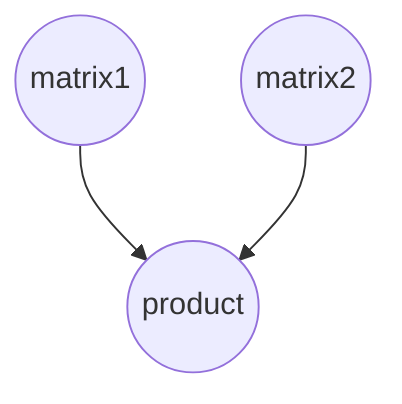

## Introduction to TensorFlow

In this chapter, we introduce and give a very brief description of basic building blocks and concepts that are used in building models. Here we also provide with an overview on how the models should be structured.

### Why TensorFlow?
TensorFlow is an open-source software library from Google for numerical computation using data flow graphs. It is the library that allows us to
* use variety of programming languages to build deep learning models, as it has Python, C++, Java and Go APIs,
* deploy computation to one or more CPUs or GPUs in a desktop, server, or mobile device with a single API,
* visualise learning, embeddings, graphs and histograms [TensorBoard](https://www.tensorflow.org/get_started/summaries_and_tensorboard),
* forget about taking derivatives by hand (Auto-differentiation).

In addition, it has a large community and many projects are already using TensorFlow.

TensorFlow has simplified interfaces, TensorFlow Estimator  ([tf.estimator](https://www.tensorflow.org/api_docs/python/tf/estimator)) and
TensorFlow Learn ([tf.contrib.learn](https://www.tensorflow.org/api_guides/python/contrib.learn)), that provide readily available models that users can simply call. This was purposely created to mimic scikit-learn for deep learning “to smooth the transition" from the scikit-learn world of one-liner machine learning into the more open world of building different shapes of machine learning models.

Both TensorFlow Estimator and TensorFlow Learn allows you to load in data, construct a model, fit your model using the training data, evaluate the accuracy, just using a single line of code. Some models that you can call using one line are  *LinearClassifier, LinearRegressor* and  *DNNClassifier*.

Google has some good tutorial on how to build model using [TensorFlow Estimator](https://www.tensorflow.org/get_started/estimator).

> Note: TensorFlow Learn was originally an independent project called Scikit Flow (SKFlow).

> Note: TensorFlow Contrib module, what TensorFlow Learn is part of, contains volatile or experimental code.

Another notable addition to the TensorFlow is the implementation of the [Keras](https://keras.io/) API, that significantly reduces the number of lines and improves readability of the code. See [TensorFlow Contrib Keras](https://www.tensorflow.org/api_docs/python/tf/contrib/keras).

However, the primary purpose of TensorFlow is not to provide out-of-the-box machine learning solutions. Instead, TensorFlow provides an extensive suite of functions and classes that allow users to define models from scratch. This is more complicated but offers much more flexibility. You can build almost any architecture you can think of in TensorFlow.

### What is TensorFlow?
Most notable difference between TensorFlow and other libraries is that TensorFlow does all its computation in graphs. A TensorFlow graph is a description of computations. That is, TensorFlow program separates the definition of computations from their execution. For more details on computational graphs see the following:
* [Calculus on Computational Graphs: Backpropagation](http://colah.github.io/posts/2015-08-Backprop/)
* [What is a TensorFlow Session?](http://danijar.com/what-is-a-tensorflow-session/)

A computational graph is a series of TensorFlow operations arranged into a graph of nodes. In the graph, nodes are called *ops* which is short-hand for *operations*. An *op* takes zero or more *Tensors*, performs some computation, and produces zero or more *Tensors*. As you might suspect, in TensorFlow *Tensor* is the basic object and it uses a tensor data structure to represent all data -- only tensors are passed between operations in the computation graph. You can think of a TensorFlow tensor as an n-dimensional array or list. The *Tensor* has a static type, a rank, and a shape. To learn more about how TensorFlow handles these concepts, see the [Rank, Shape, and Type reference](https://www.tensorflow.org/programmers_guide/dims_types).

For example, in the case of the patient records *Tensor* is a 3-D array with dimensions **[patients, record_lengh, features]** or in case of images it is a 4-D array where dimensions are **[images, height, width, channels]**.

### How does TensorFlow works?

As the example, to build a graph we start with *ops* that do not need any input, such as `Constant`, and pass their output to other *ops* that do a computation.

The *ops* constructors in the Python library return objects that stand for the output of the constructed *ops*. You can pass these to other *ops* constructors to use as inputs.

The TensorFlow Python library has a default graph to which *ops* constructors add nodes. The default graph is sufficient for many applications.

As mentioned before, we first define the computational graph by adding nodes to the default graph in Python as follows:
```python
import tensorflow as tf
# Create a Constant op that produces a 1x2 matrix.  The op is
# added as a node to the default graph.

# The value returned by the constructor represents the output
# of the Constant op. It is matrix of shape 1x2.
matrix1 = tf.constant([[1., 2.]])
# Create another Constant that produces a 2x1 matrix.
matrix2 = tf.constant([[3.], [4.]])
# Create a Matmul op that takes 'matrix1' and 'matrix2' as inputs.
# The returned value, 'product', represents the result of the matrix
# multiplication. Output is a matrix of shape 1x1.
product = tf.matmul(matrix1, matrix2)
```

The default graph now has three nodes: two `tf.constant()` *ops* and one `tf.matmul()` *op*, it can be visualised as:



To actually multiply the matrices, and get the result of the multiplication, we must launch the graph in a session.

Create a `Session` object without arguments, this launches the default graph.

```python
# Launch the default graph.
sess = tf.Session()
# To run the matmul op we call the session 'run()' method, passing 'product'
# which represents the output of the matmul op.  This indicates to the call
# that we want to get the output of the matmul op back.

# All inputs needed by the op are run automatically by the session.  They
# typically are run in parallel.

# The call 'run(product)' thus causes the execution of all three ops in the
# graph.

# The output of the matmul is returned in 'result' as a numpy `ndarray` object.
result = sess.run(product)
print(result)  # expected value is [[ 11.]]
# Close the Session when we are done.
sess.close()
```

It is also possible enter a `Session` with a `with` block. The `Session` closes automatically at the end of the `with` block and thus `sess.close()` is not needed:

```python
with tf.Session() as sess:
  result = sess.run([product])
  print(result)
```

You sometimes see `InteractiveSession` instead of `Session`. The only difference is an
`InteractiveSession` makes itself the default session so you can call `Tensor.eval()` and/or `Operation.run()` without explicitly call the session. This is convenient in interactive shells and Jupyter Notebooks, as it avoids having to pass an explicit `Session` object to run *ops*. However, it is complicated when you have multiple sessions to run. For more information see [here](https://learningtensorflow.com/lesson5/)

### Data Types in TensorFlow
TensorFlow takes in Python native types such as Python boolean values, numeric values (integers, floats), and strings. Single values will be converted to 0-d tensors (or scalars), lists of values will be converted to 1-d tensors (vectors), lists of lists of values will be converted to 2-d tensors (matrices), and so on. However, TensorFlow also has its own data types, such as, `tf.int32`, `tf.float32`, for more detailed description see [here](https://www.tensorflow.org/programmers_guide/dims_types). These types are actually based on those of NumPy and thus, in most cases, they can be used interchangeably.


### Code
 * [00_first_step.py](scripts/00_first_step.py)

### References
1. [colah's blog](http://colah.github.io/)
2. [CS 20SI: Tensorflow for Deep Learning Research](http://web.stanford.edu/class/cs20si/index.html)
3. [Danijar Hafner](http://danijar.com/)
4. [Keras](https://keras.io/)
5. [LearningTensorFlow.com](https://learningtensorflow.com/)
6. [TensorFlow](/www.tensorflow.org)
